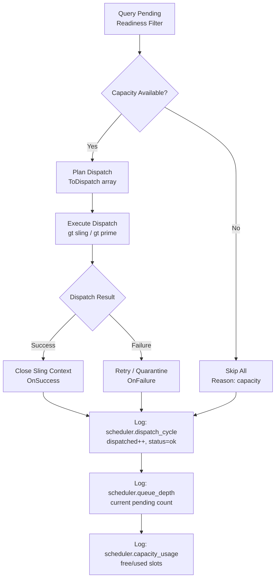

# OpenTelemetry Architecture

## Overview

Gas Town uses OpenTelemetry (OTel) for structured observability of all agent operations. Telemetry is emitted via standard OTLP HTTP to any compatible backend (metrics, logs).

**Backend-agnostic design**: The system emits standard OpenTelemetry Protocol (OTLP) — any OTLP v1.x+ compatible backend can consume it. You are **not obligated** to use VictoriaMetrics/VictoriaLogs; these are simply development defaults.

**Best-effort design**: Telemetry initialization errors are returned but do not affect normal GT operation. The system remains functional even when telemetry is unavailable.

---

---

## Implementation Status

### Core Telemetry (In main ✅)

| Feature | Status | Notes |
|---------|--------|-------|
| Core OTel initialization | ✅ Implemented | `telemetry.Init()`, providers setup |
| Metrics export (counters) | ✅ Implemented | 25+ metric instruments |
| Metrics export (histograms) | ✅ Implemented | `bd.duration_ms` histogram |
| Logs export (any OTLP backend) | ✅ Implemented | OTLP logs exporter |
| Subprocess correlation | ✅ Implemented | `GT_RUN` propagation, `OTEL_RESOURCE_ATTRIBUTES` |

### Session Lifecycle (In main ✅)

| Feature | Status | Notes |
|---------|--------|-------|
| **Session lifecycle** | ✅ Implemented | `session.start`/`session.stop` events (tmux lifecycle) |
| **Agent instantiation** | ✅ Implemented | `agent.instantiate` event (root event with full metadata) |

### Workflow & Work Events (In main ✅)

| Feature | Status | Notes |
|---------|--------|-------|
| Prompt/nudge telemetry | ✅ Implemented | `prompt.send` events |
| BD operation telemetry | ✅ Implemented | `bd.call` events (stdout/stderr opt-in via `GT_LOG_BD_OUTPUT=true`) |
| Mail telemetry | ✅ Implemented | `mail` operations |
| Sling/nudge/done telemetry | ✅ Implemented | All workflow events |
| GT prime telemetry | ✅ Implemented | `prime` + `prime.context` events |

### Agent Lifecycle (In main ✅)

| Feature | Status | Notes |
|---------|--------|-------|
| Polecat lifecycle telemetry | ✅ Implemented | `polecat.spawn`/`polecat.remove` |
| Agent state telemetry | ✅ Implemented | `agent.state_change` events |
| Daemon restart telemetry | ✅ Implemented | `daemon.restart` events |
| Polecat spawn metric | ✅ Implemented | `gastown.polecat.spawns.total` |

### Molecule Lifecycle (In main ✅)

| Feature | Status | Notes |
|---------|--------|-------|
| Molecule lifecycle telemetry | ✅ Implemented | `mol.cook`/`mol.wisp`/`mol.squash`/`mol.burn` |
| Bead creation telemetry | ✅ Implemented | `bead.create` events |
| Formula instantiation telemetry | ✅ Implemented | `formula.instantiate` |
| Convoy telemetry | ✅ Implemented | `convoy.create` events |

### Agent Events (In main ✅)

| Feature | Status | Notes |
|---------|--------|-------|
| **Agent conversation events** | ✅ Available in main | `agent.event` per conversation turn (text/tool_use/tool_result/thinking) |
| **Token usage tracking** | ✅ Available in main | `agent.usage` per assistant turn (input/output/cache_read/cache_creation) |
| **Cloud session correlation** | ✅ Available in main | `native_session_id` linking Claude to GT telemetry |
| **Agent logging daemon** | ✅ Available in main | `gt agent-log` detached process for JSONL streaming |

**Activation**: Requires `GT_LOG_AGENT_OUTPUT=true` AND `GT_OTEL_LOGS_URL` set to enable agent event streaming. See [Configuration](#environment-variables) section for details.

---

## Future Evolution

### To Implement Next

| Priority                        | Description                                                                                                                 |
| ------------------------------- | --------------------------------------------------------------------------------------------------------------------------- |
| **Polecat → Rig/Build context** | ⚠️ **Critical** — Inject `GT_WORK_RIG`, `GT_WORK_BEAD`, `GT_WORK_BUILD` during `gt prime` to trace work to correct rig/bead |
| **Native AI session correlation** | Improve link between native AI agent sessions and work context (e.g., Claude Code, OpenCode, custom adapters via `AgentAdapter` interface) |
| **Cross-rig work tracing** | Correlate when same polecat works on different rigs |
| **Work-context telemetry** | Enrich events with work metadata (rig/bead/build) |


---

### Improvement Ideas

| Domain | Idea |
|----------|-------|
| **Dolt health monitoring** | Expose Dolt health metrics to telemetry (connections, queries) |
| **Refinery queue depth** | Expose Refinery pending work queue size |
| **Scheduler dispatch logs** | Trace scheduler cycles: queue depth, dispatched count, capacity usage, failures |
| | - `scheduler.dispatch_cycle` (metrics + log): dispatched, failed, skipped counts per cycle |
| | - `scheduler.queue_depth` (histogram): current pending beads queue size |
| | - `scheduler.capacity_usage` (gauge): free/used dispatch slots |
**Scheduler telemetry flow** (once implemented):



| **Session health scores** | Score session health by success/error rates |
|----------|-------|
| **Work completion time** | Histogram of completion time per role/rig/work type |
| **Token efficiency** | Tokens per unit of work (bead) |
| **Retry patterns** | Identify polecats with high failure/retry rates |

---

## Components

### 1. Initialization (`internal/telemetry/telemetry.go`)

The `telemetry.Init()` function sets up OTel providers on process startup:

```go
provider, err := telemetry.Init(ctx, "gastown", version)
if err != nil {
    // Log and continue — telemetry is best-effort
}
defer provider.Shutdown(ctx)
```

**Providers:**
- **Metrics**: Any OTLP-compatible metrics backend via `otlpmetrichttp` exporter
- **Logs**: Any OTLP-compatible logs backend via `otlploghttp` exporter

**Default endpoints** (when GT_OTEL_* variables are not set):
- Metrics: `http://localhost:8428/opentelemetry/api/v1/push`
- Logs: `http://localhost:9428/insert/opentelemetry/v1/logs`

> **Note**: These defaults target VictoriaMetrics/VictoriaLogs for local development convenience. Gas Town uses standard OTLP — you can override endpoints to use any OTLP v1.x+ compatible backend (Prometheus, Grafana Mimir, Datadog, New Relic, Grafana Cloud, Loki, OpenTelemetry Collector, etc.).

**OTLP Compatibility**:
- Uses standard OpenTelemetry Protocol (OTLP) over HTTP
- Protobuf encoding (VictoriaMetrics, Prometheus, and others accept this)
- Compatible with any backend that supports OTLP v1.x+

**Resource attributes** (set at init time):
- `service.name`: "gastown"
- `service.version`: GT binary version
- `host`: system hostname
- `os`: system OS info

**Custom resource attributes** (via `OTEL_RESOURCE_ATTRIBUTES` env var):
- `gt.role`: Agent role (`mayor`, `deacon`, `witness`, `polecat`, `crew`, etc.)
- `gt.rig`: Rig name (e.g., `gastown`, `beads`)
- `gt.actor`: BD actor/identity (`mayor`, `deacon/boot`, `beads/witness`, etc.)
- `gt.agent`: Polecat/crew name (e.g., `Toast`, `max`)
- `gt.session`: Tmux session name (e.g., `hq-mayor`, `gt-gastown-Toast`)
- `gt.run_id`: Gas Town run UUID (correlation key for waterfall traces)

---

### 2. Recording Layer (`internal/telemetry/recorder.go`)

The recorder provides type-safe functions for emitting all GT telemetry events. Each function emits:

1. **OTel metric counter** (→ VictoriaMetrics, aggregated)
2. **OTel log record** (→ VictoriaLogs, full detail)

All events automatically carry `run.id` from context or `GT_RUN` env var for waterfall correlation.

#### Recording Pattern

```go
func RecordSomething(ctx context.Context, args ..., err error) {
    initInstruments() // Lazy-load OTel instruments
    status := statusStr(err) // "ok" or "error"
    inst.somethingTotal.Add(ctx, 1, metric.WithAttributes(
        attribute.String("status", status),
        attribute.String("label", value),
    ))
    emit(ctx, "something", severity(err),
        otellog.String("key1", value1),
        otellog.String("key2", value2),
        statusStr(err),
        errKV(err), // Empty string or error message
    )
}
```

#### Instrument Types

| Type | Description | Example |
|------|-------------|---------|
| Counters | Total counts per attribute combination | `gastown.polecat.spawns.total{rig="gastown", status="ok"}` |
| Histograms | Distribution of measurements (latency, duration) | `gastown.bd.duration_ms` |
| Log records | Structured events with full payload | `agent.instantiate`, `mail`, `agent.event` |

---

### 3. Context Propagation

#### Run ID (`gt.run_id`)

Each agent session spawn generates a unique `GT_RUN` UUID. This is the primary correlation key:

- **Inherited by subprocesses**: BD, mail, and native AI agent sessions all see `GT_RUN` |
- **Propagated via context**: `telemetry.WithRunID(ctx, runID)` injects it into all telemetry
- **Carried in OTEL_RESOURCE_ATTRIBUTES**: `gt.run_id` attribute for subprocess telemetry

**Waterfall correlation diagram:**

```mermaid
flowchart TD
    A[Session Start<br/>gt polecat add / gt sling ...<br/>GT_RUN=uuid-1234<br/>session.StartSession] --> B[Environment Setup<br/>GT_RUN env var<br/>OTEL_RESOURCE_ATTRIBUTES<br/>Subprocesses inherit]
    B --> C[Agent Lifecycle<br/>1. agent.instantiate<br/>2. prime<br/>3. agent.events*<br/>(opt-in via GT_LOG_AGENT_OUTPUT=true)]
    C --> D[Work Operations<br/>bd.call*<br/>mail<br/>sling<br/>done]
    D --> E[VictoriaLogs Backend<br/>All events indexed<br/>by run.id]

    style A fill:#e1f5ff
    style B fill:#b8d4ff
    style C fill:#8cc5ff
    style D fill:#5aaaff
    style E fill:#3388ff
```

**Query example:** Retrieve all events for a single session run
```logsql
_msg:* | json run.id = "uuid-1234"
```
This returns the complete waterfall: agent.instantiate → prime → bd.call(s) → agent.event(s) → mail → sling → done

#### Subprocess Integration (`internal/telemetry/subprocess.go`)

Two mechanisms ensure subprocess telemetry is correlated:

**1. Process-level inheritance** (`SetProcessOTELAttrs`):
- Called once at GT startup
- Sets `OTEL_RESOURCE_ATTRIBUTES` in process environment
- All `exec.Command()` subprocesses inherit these env vars automatically

**2. Manual injection** (`OTELEnvForSubprocess`):
- For callers building `cmd.Env` explicitly (overriding `os.Environ`)
- Returns pre-built env slice with:
  - `OTEL_RESOURCE_ATTRIBUTES` (GT context attributes)
  - `BD_OTEL_METRICS_URL` (mirrors `GT_OTEL_METRICS_URL`)
  - `BD_OTEL_LOGS_URL` (mirrors `GT_OTEL_LOGS_URL`)
  - `GT_RUN` (run ID for correlation)

---

### 4. Agent Logging (`internal/session/agent_logging_unix.go`)

**Opt-in feature**: `GT_LOG_AGENT_OUTPUT=true` streams native AI agent JSONL to VictoriaLogs.

**How it works:**
1. `ActivateAgentLogging()` spawns detached `gt agent-log` process
2. Uses `Setsid` so it survives parent process exit
3. PID file at `/tmp/gt-agentlog-<session>.pid` ensures single instance
4. `--since=now-60s` filters to only this session's Claude instance
5. `gt agent-log` tails JSONL files and emits `RecordAgentEvent` for each

**Events emitted:**
- `agent.event`: One record per conversation turn (text, tool_use, tool_result, thinking)
- `agent.usage`: Token usage per assistant turn (input, output, cache stats)

**Session name in telemetry:**
- `session`: Tmux session name (e.g., `gt-gastown-Toast`)
- `native_session_id`: Claude Code JSONL filename UUID

---

## Environment Variables

### GT-Level Variables

| Variable | Set by | Description |
|----------|---------|-------------|
| `GT_OTEL_METRICS_URL` | Operator | OTLP metrics endpoint (default: localhost:8428) |
| `GT_OTEL_LOGS_URL` | Operator | OTLP logs endpoint (default: localhost:9428) |
| `GT_LOG_AGENT_OUTPUT` | Operator | **Opt-in**: Stream Claude conversation events |
| `GT_LOG_BD_OUTPUT` | Operator | **Opt-in**: Include bd stdout/stderr in `bd.call` records |

### Session Context Variables (Set by `session.StartSession`)

| Variable | Format | Example | Used By |
|----------|--------|---------| |
| `GT_ROLE` | `<rig>/polecats/<name>` or `mayor` or `beads/witness` | Agent role for identity parsing |
| `GT_RIG` | `gastown`, `beads` | Rig name (empty for town-level agents) |
| `GT_POLECAT` | `Toast`, `Shadow`, `Furiosa` | Polecat name (rig-specific) |
| `GT_CREW` | `max`, `jane` | Crew member name |
| `GT_SESSION` | `gt-gastown-Toast`, `hq-mayor` | Tmux session name |
| `GT_AGENT` | `claudecode`, `codex` | Agent override (if specified) |
| `GT_RUN` | UUID v4 | Run identifier — primary waterfall correlation key |
| `GT_ROOT` | `/Users/pa/gt` | Town root path |
| `CLAUDE_CONFIG_DIR` | `~/gt/.claude` | Runtime config directory (for agent overrides) |
| `BD_ACTOR` | `<rig>/polecats/<name>` | BD actor identity (git author) |
| `GIT_AUTHOR_NAME` | Agent name | Git author name |
| `GIT_CEILING_DIRECTORIES` | Town root | Git ceiling (prevents repo traversal) |

---

## Event Types

### Core Events

| Event | Trigger | Key Attributes |
|-------|---------|----------------|
| `agent.instantiate` | Session start (all agents) | `run.id`, `agent_type`, `role`, `agent_name`, `session_id`, `rig`, `issue_id`, `git_branch`, `git_commit` |
| `session.start` / `session.stop` | Tmux session lifecycle | `run.id`, `session_id`, `role`, `status` |
| `prime` | Each `gt prime` invocation | `run.id`, `role`, `hook_mode`, `formula` (in separate `prime.context` event), `status` |

### Agent Events (Opt-in)

| Event | Trigger | Key Attributes |
|-------|---------|----------------|
| `agent.event` | Claude conversation turn | `run.id`, `session`, `native_session_id`, `agent_type`, `event_type`, `role`, `content` |
| `agent.usage` | Token usage per turn | `run.id`, `session`, `native_session_id`, `input_tokens`, `output_tokens`, `cache_read_tokens`, `cache_creation_tokens` |

### Work & Mail Events

| Event | Trigger | Key Attributes |
|-------|---------|----------------|
| `bd.call` | Each invocation of `bd` CLI | `run.id`, `subcommand`, `args`, `duration_ms`, `stdout`, `stderr` (see PR #2068 for details), `status` |
| `mail` | All operations on Gastown mail system | `run.id`, `operation`, `msg.id`, `msg.from`, `msg.to`, `msg.subject`, `msg.body`, `msg.thread_id`, `msg.priority`, `msg.type`, `status` |

### State & Lifecycle Events

| Event | Trigger | Key Attributes |
|-------|---------|----------------|
| `agent.state_change` | Agent transition | `run.id`, `agent_id`, `new_state`, `hook_bead`, `status` |
| `daemon.restart` | Witness-initiated restart | `run.id`, `agent_type` |

### Molecule Events

| Event | Trigger | Key Attributes |
|-------|---------|----------------|
| `mol.cook` / `mol.wisp` / `mol.squash` / `mol.burn` | Molecule lifecycle events emitted at each stage of formula workflow |

**`mol.cook`** — formula compiled to a proto (prerequisite for wisp creation):

| Attribute | Type | Description |
|---|---|---|
| `run.id` | string | run UUID |
| `formula_name` | string | formula name (e.g. `"mol-polecat-work"`) |
| `status` | string | `"ok"` · `"error"` |

**`mol.wisp`** — proto instantiated as a live wisp (ephemeral molecule instance):

| Attribute | Type | Description |
|---|---|---|
| `run.id` | string | run UUID |
| `formula_name` | string | formula name |
| `wisp_root_id` | string | root bead ID of created wisp |
| `bead_id` | string | base bead bonded to wisp; empty for standalone formula slinging |
| `status` | string | `"ok"` · `"error"` |

**`mol.squash`** — molecule execution completed and collapsed to a digest:

| Attribute | Type | Description |
|---|---|---|
| `run.id` | string | run UUID |
| `mol_id` | string | molecule root bead ID |
| `done_steps` | int | number of steps completed |
| `total_steps` | int | total steps in the molecule |
| `digest_created` | bool | false when `--no-digest` flag was set |
| `status` | string | `"ok"` · `"error"` |

**`mol.burn`** — molecule destroyed without creating a digest:

| Attribute | Type | Description |
|---|---|---|
| `run.id` | string | run UUID |
| `mol_id` | string | molecule root bead ID |
| `children_closed` | int | number of descendant step beads closed |
| `status` | string | `"ok"` · `"error"` |

### `bead.create`

| Event | Trigger | Key Attributes |
|-------|---------|----------------|
| `bead.create` | Child bead during molecule instantiation | `run.id`, `bead_id`, `parent_id`, `mol_source` |

### Other events

All carry `run.id`.

| Event body | Key attributes |
|---|---|
| `sling` | `bead`, `target`, `status`, `error` |
| `nudge` | `target`, `status`, `error` |
| `done` | `exit_type` (`COMPLETED` · `ESCALATED` · `DEFERRED`), `status`, `error` |
| `polecat.spawn` | `name`, `status`, `error` |
| `polecat.remove` | `name`, `status`, `error` |
| `formula.instantiate` | `formula_name`, `bead_id`, `status`, `error` (top-level formula-on-bead result) |
| `convoy.create` | `bead_id`, `status`, `error` |
| `daemon.restart` | `agent_type` |

---

## Monitoring Gaps

### Currently Monitored ✅

| Area | Coverage |
|-------|----------|
| Agent session lifecycle | Full (start, stop, respawn) |
| Agent instantiation | Full (all agents, with metadata) |
| Tmux prompts/nudges | Full (content, debouncing) |
| Agent conversation events | Partial - requires `GT_LOG_AGENT_OUTPUT=true` |
| Token usage | Partial - requires `GT_LOG_AGENT_OUTPUT=true` |
| BD operations | Full (all BD CLI calls) |
| Mail operations | Full (send, read, archive, delete) |
| Polecat lifecycle | Full (spawn, remove, state changes) |
| Molecule lifecycle | Full (cook, wisp, squash, burn) |
| Bead creation | Full (all child beads during instantiation) |
| Convoy tracking | Full (auto-convoy creation) |
| Daemon restarts | Full (witness/deacon-initiated) |
| GT prime operations | Full (with formula context) |

### Not Currently Monitored ❌

| Area | Notes | Operational Impact |
|-------|-------|-------------------|
| **Polecat → Rig/Build context** | **Critical gap** — see [Cross-Rig Work Context Issue](#cross-rig-work-context-issue-) below | Cannot attribute cross-rig work to correct rig; inaccurate cost allocation |
| Dolt server health | Handled by pre-spawn health checks, but not exposed to telemetry | Database issues only detected at spawn time; no real-time health monitoring |
| Refinery merge queue | Internal operation, not surfaced via telemetry | Cannot monitor merge backlog or detect bottlenecks |
| Scheduler dispatch logs | Capacity-controlled dispatch cycles not exposed to telemetry | Cannot track dispatch efficiency, queue depth, or capacity utilization |
| Crew worktree operations | No explicit tracking of crew session cycles | Cannot track crew efficiency or session patterns |
| Git operations (clone, checkout, etc.) | Git author/name is set, but individual operations not tracked | Cannot diagnose git-related failures or track repository operations |
| Resource usage (CPU, memory, disk) | Not instrumented — consider OTel process metrics | Cannot detect resource exhaustion or capacity planning needs |
| Network activity | Not instrumented (Claude API calls logged by agent, but external traffic not) | Cannot diagnose network issues or detect unusual external connections |
| File system operations | Not instrumented (e.g., file reads/writes in session) | Cannot trace file system activity or diagnose I/O bottlenecks |
| Cross-rig worktree operations | Worktrees are created/managed but operations not tracked | Cannot correlate worktree lifecycle with work items |
| Witness monitoring loops | Health checks happen but not exposed to observability | Cannot monitor witness health trends or detect degraded performance |
| Deacon watchdog chain | Internal state machine, not currently exposed to observability | Cannot track deacon health or detect daemon failures |

---

## Cross-Rig Work Context Issue ⚠️

**Critical gap**: Polecats are rig-scoped identities but their sessions are shared across all rigs. When a polecat is reused across rigs, telemetry reflects the **original allocation rig**, not the **current work rig**.

**Impact**:
- Cannot determine which rig's work a polecat session is doing from telemetry alone
- Token usage cannot be accurately attributed to specific rigs or builds
- Cloud session logs don't show correct context when investigating issues

**Proposed solution** (see [Future Evolution](#future-evolution) above):
- Inject `GT_WORK_RIG`, `GT_WORK_BEAD`, `GT_WORK_BUILD` during `gt prime`
- Carry current work context in `agent.instantiate` event attributes
- Enable cloud session correlation to correct bead/build context

---

## Data Model

See [OTel Data Model](otel-data-model.md) for complete schema of all events.

> The data model is independent of backend — any OTLP-compatible consumer can parse and query these events.

---

## Queries

### Metrics (Any OTLP-compatible backend)

> These examples use PromQL, but equivalent query languages work with your chosen backend (VictoriaMetrics, Prometheus, Grafana Mimir, etc.)

**Total counts by status:**
```promql
sum(rate(gastown.polecat.spawns.total[5m])) by (status, rig)
sum(rate(gastown.bd.calls.total[5m])) by (subcommand, status)
```

**Latency distributions:**
```promql
histogram_quantile(gastown.bd.duration_ms, 0.5) by (subcommand)
histogram_quantile(gastown.bd.duration_ms, 0.95) by (subcommand)
histogram_quantile(gastown.bd.duration_ms, 0.99) by (subcommand)
```

**Waterfall by run:**
```promql
sum(increase(gastown.session.starts.total)) by (run.id)
sum(increase(gastown.prompt.sends.total)) by (run.id)
sum(increase(gastown.agent.events.total)) by (run.id, event_type)
```

### VictoriaLogs (Structured Logs)

**Find all events for a run:**
```logsql
_msg:agent.instantiate | json run.id = "uuid-1234"
_msg:agent.event | json run.id = "uuid-1234"
_msg:bd.call | json run.id = "uuid-1234"
```

**Error analysis:**
```logsql
_msg:* | json status = "error" | level >= ERROR
_msg:bd.call | json status = "error"
_msg:session.stop | json status = "error"
```

**Polecat lifecycle:**
```logsql
_msg:polecat.spawn
_msg:polecat.remove
_msg:agent.state_change | json new_state = "working" or new_state = "idle"
```

### Debugging Examples

**Track a polecat working across multiple rigs:**
```logsql
_msg:* | json agent_name = "Toast"
```
Shows all events from polecat Toast, regardless of rig assignment.

**Identify sessions with high error rates:**
```logsql
_msg:bd.call | json status = "error" | time:5m
```
Group by error count over 5-minute windows.

**Find sessions where tokens are consumed but no work is completed:**
```logsql
_msg:agent.usage
_msg:done | time:1h
```
Correlate token usage with work completion (done events) within same hour.

**Cross-rig work analysis** (future, once work context is implemented):
```logsql
_msg:agent.instantiate | json role = "polecat"
_msg:bd.call | json subcommand = "update"
_msg:mail | json operation = "send"
```
When GT_WORK_RIG is implemented, you can filter by work_rig attribute to trace cross-rig work assignments.

---

## Related Documentation

- [OTel Data Model](otel-data-model.md) — Complete event schema
- [Polecat Lifecycle](concepts/polecat-lifecycle.md) — Persistent polecat model
- [Overview](overview.md) — Role taxonomy and architecture
- [Reference](reference.md) — Environment variables and commands

## Backends Compatible with OTLP

| Backend | Notes |
|---------|-------|
| **VictoriaMetrics** | Default for metrics (localhost:8428) — open source. Override with `GT_OTEL_METRICS_URL` to use any OTLP-compatible backend. |
| **VictoriaLogs** | Default for logs (localhost:9428) — open source. Override with `GT_OTEL_LOGS_URL` to use any OTLP-compatible backend. |
| **Prometheus** | Supports OTLP via remote_write receiver — open source |
| **Grafana Mimir** | Supports OTLP via write endpoint — open source |
| **Loki** | Requires OTLP bridge (Loki uses different format) — open source |
| **OpenTelemetry Collector** | Universal forwarder to any backend (recommended for production) — open source |

**Production Recommendation**: For production deployments, consider using the OpenTelemetry Collector as a sidecar. The Collector provides:
- Single agent for all telemetry
- Advanced processing and batching
- Support for multiple backends simultaneously
- Better resource efficiency than per-process exporters
