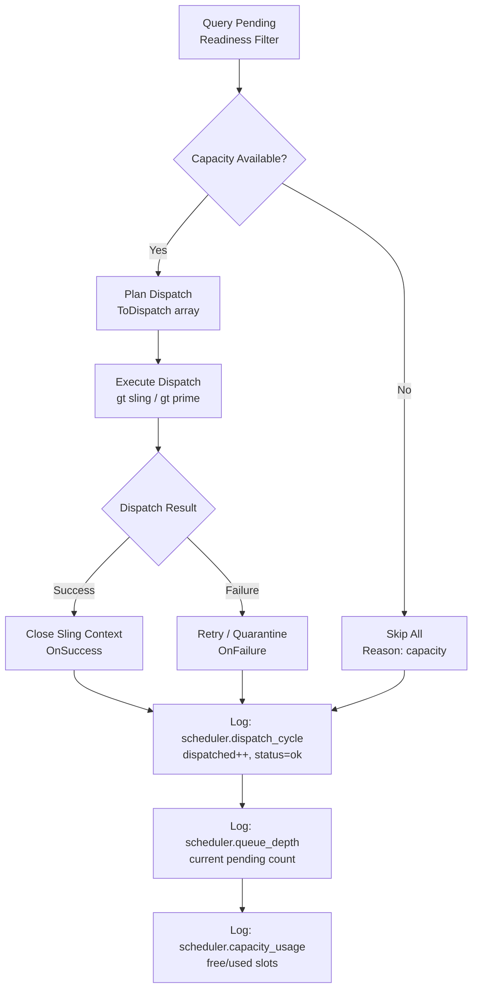

# OpenTelemetry Architecture

## Overview

Gas Town uses OpenTelemetry (OTel) for structured observability of all agent operations. Telemetry is emitted via standard OTLP HTTP to any compatible backend (metrics, logs).

**Backend-agnostic design**: The system emits standard OpenTelemetry Protocol (OTLP) — any OTLP v1.x+ compatible backend can consume it. You are **not obligated** to use VictoriaMetrics/VictoriaLogs; these are simply development defaults.

**Best-effort design**: Telemetry initialization errors are returned but do not affect normal GT operation. The system remains functional even when telemetry is unavailable.

---

## Quick Setup

Set at least one endpoint variable to activate telemetry — both endpoints unset means telemetry is completely disabled (no instrumentation code runs):

```bash
# Full local setup (recommended)
export GT_OTEL_METRICS_URL=http://localhost:8428/opentelemetry/api/v1/push
export GT_OTEL_LOGS_URL=http://localhost:9428/insert/opentelemetry/v1/logs

# Opt-in features
export GT_LOG_AGENT_OUTPUT=true   # Stream Claude conversation turns to logs
export GT_LOG_BD_OUTPUT=true      # Include bd stdout/stderr in bd.call records
```

**Local backends (Docker):**
```bash
docker run -d -p 8428:8428 victoriametrics/victoria-metrics
docker run -d -p 9428:9428 victoriametrics/victoria-logs
```

**Verify:** `gt prime` should emit a `prime` event visible at `http://localhost:9428/select/vmui`.

---

## Implementation Status

### Core Telemetry (In main ✅)

| Feature | Status | Notes |
|---------|--------|-------|
| Core OTel initialization | ✅ Implemented | `telemetry.Init()`, providers setup |
| Metrics export (counters) | ✅ Implemented | 25+ metric instruments |
| Metrics export (histograms) | ✅ Implemented | `bd.duration_ms` histogram |
| Logs export (any OTLP backend) | ✅ Implemented | OTLP logs exporter |
| Subprocess correlation | ✅ Implemented | `GT_RUN` propagation, `OTEL_RESOURCE_ATTRIBUTES` |

### Session Lifecycle (In main ✅)

| Feature | Status | Notes |
|---------|--------|-------|
| **Session lifecycle** | ✅ Implemented | `session.start`/`session.stop` events (tmux lifecycle) |
| **Agent instantiation** | ✅ Implemented | `agent.instantiate` event (root event with full metadata) |

### Workflow & Work Events (In main ✅)

| Feature | Status | Notes |
|---------|--------|-------|
| Prompt/nudge telemetry | ✅ Implemented | `prompt.send` events |
| BD operation telemetry | ✅ Implemented | `bd.call` events (stdout/stderr opt-in via `GT_LOG_BD_OUTPUT=true`) |
| Mail telemetry | ✅ Implemented | `mail` operations |
| Sling/nudge/done telemetry | ✅ Implemented | All workflow events |
| GT prime telemetry | ✅ Implemented | `prime` + `prime.context` events |

### Agent Lifecycle (In main ✅)

| Feature | Status | Notes |
|---------|--------|-------|
| Polecat lifecycle telemetry | ✅ Implemented | `polecat.spawn`/`polecat.remove` |
| Agent state telemetry | ✅ Implemented | `agent.state_change` events |
| Daemon restart telemetry | ✅ Implemented | `daemon.restart` events |
| Polecat spawn metric | ✅ Implemented | `gastown.polecat.spawns.total` |

### Molecule Lifecycle (In main ✅)

| Feature | Status | Notes |
|---------|--------|-------|
| Molecule lifecycle telemetry | ✅ Implemented | `mol.cook`/`mol.wisp`/`mol.squash`/`mol.burn` |
| Bead creation telemetry | ✅ Implemented | `bead.create` events |
| Formula instantiation telemetry | ✅ Implemented | `formula.instantiate` |
| Convoy telemetry | ✅ Implemented | `convoy.create` events |

### Agent Events (In main ✅)

| Feature | Status | Notes |
|---------|--------|-------|
| **Agent conversation events** | ✅ Available in main | `agent.event` per conversation turn (text/tool_use/tool_result/thinking) |
| **Token usage tracking** | ✅ Available in main | `agent.usage` per assistant turn (input/output/cache_read/cache_creation) |
| **Cloud session correlation** | ✅ Available in main | `native_session_id` linking Claude to GT telemetry |
| **Agent logging daemon** | ✅ Available in main | `gt agent-log` detached process for JSONL streaming |

**Activation**: Requires `GT_LOG_AGENT_OUTPUT=true` AND `GT_OTEL_LOGS_URL` set to enable agent event streaming. See [Configuration](#environment-variables) section for details.

---

## Roadmap

### P0 — Critical (blocking accurate attribution)

**Work context injection at `gt prime`**

Polecats are **generic agents** — they have no fixed rig. `GT_RIG` at session start reflects an allocation rig or is empty, which is meaningless for attributing work. The actual work context (which rig, bead, and molecule a polecat is processing) is only known at each `gt prime` invocation.

A single polecat session goes through multiple `gt prime` cycles, each on a potentially different rig and bead:

```
session start → rig="" (generic, no work yet)
gt prime #1   → work_rig="gastown", work_bead="sg-05iq", work_mol="mol-polecat-work"
  bd.call, mail, sling, done  ← carry work context from prime #1
gt prime #2   → work_rig="sfgastown", work_bead="sg-g8vs", work_mol="mol-polecat-work"
  bd.call, mail, sling, done  ← carry work context from prime #2
```

Fix: at each `gt prime`, inject `GT_WORK_RIG`, `GT_WORK_BEAD`, `GT_WORK_MOL` into the **tmux session environment** (via `SetEnvironment`), not just emit them as log attributes. This ensures all subsequent subprocesses (`bd`, mail, agent logging) inherit the current work context automatically until the next prime overwrites it.

New attributes emitted on the `prime` event and carried by all events until the next prime:

| Attribute | Type | Description |
|---|---|---|
| `work_rig` | string | rig whose bead is on the hook |
| `work_bead` | string | bead ID currently hooked |
| `work_mol` | string | molecule ID if the bead is a molecule step; empty otherwise |

---

### P1 — High value

**Token cost metric (`gastown.token.cost_usd`)**

Compute dollar cost per run from token counts using Claude model pricing. Emit as a Gauge metric at session end. Enables per-rig and per-bead cost dashboards.

New metric: `gastown.token.cost_usd{rig, role, agent_type}` — accumulated cost per session.
New event attribute on `agent.usage`: `cost_usd` — cost of the current turn.

---

**Go runtime/process metrics (low effort)**

The OTel Go SDK has a contrib package (`go.opentelemetry.io/contrib/instrumentation/runtime`) that auto-emits goroutine count, GC pause duration, heap usage, and memory allocations. Activation is ~5 lines of code in `telemetry.Init()`.

New metrics: `process.runtime.go.goroutines`, `process.runtime.go.gc.pause_ns`, `process.runtime.go.mem.heap_alloc_bytes`

---

**Refinery queue telemetry**

The Refinery's merge queue is a central health indicator but currently completely dark to observability. Expose:

| Metric | Type | Description |
|--------|------|-------------|
| `gastown.refinery.queue_depth` | Gauge | pending items in merge queue |
| `gastown.refinery.item_age_ms` | Histogram | age of oldest item in queue |
| `gastown.refinery.dispatch_latency_ms` | Histogram | time between enqueue and dispatch |

New log event: `refinery.dispatch` with `bead_id`, `queue_depth`, `wait_ms`, `status`.

---

**Distributed Traces (OTel Traces SDK)**

Currently the waterfall relies on `run.id` as a manual correlation key across flat log records. Replacing this with proper OTel Traces would enable:

- Visual waterfall in Jaeger / Grafana Tempo
- Automatic parent → child span attribution (no manual run.id joins)
- P95/P99 latency per operation derived from spans, not histograms

Architecture: each polecat session spawn creates a **root span** (`gt.session`). Child spans are created for `bd.call`, `mail`, `sling`, `done`. The `run.id` becomes the trace ID. `GT_RUN` propagation becomes W3C `traceparent` header injection.

This is a significant effort (requires `go.opentelemetry.io/otel/trace` + tracer provider + exporter) but would be the single highest-impact observability improvement.

---

### P2 — Medium value

**Scheduler dispatch telemetry**

Expose the capacity-controlled dispatch cycle:



New metrics: `scheduler.dispatch_cycle` (dispatched/failed/skipped counts), `scheduler.queue_depth` (histogram), `scheduler.capacity_usage` (gauge).

---

**`done` event enrichment**

Currently `done` carries only `exit_type` and `status`. Adding work context enables per-rig completion analysis:

New attributes: `rig`, `bead_id`, `time_to_complete_ms` (wall time from session start to done).

---

**Witness patrol cycle telemetry**

Each witness patrol cycle should emit: duration, stale sessions detected, restarts triggered. Enables trend analysis on witness health.

New event: `witness.patrol` with `duration_ms`, `stale_count`, `restart_count`, `status`.

---

**Dolt health metrics**

Dolt issues are only detected at spawn time today. Exposing health metrics continuously:

New metrics: `gastown.dolt.connections`, `gastown.dolt.query_duration_ms` (histogram), `gastown.dolt.replication_lag_ms`.

---

### P3 — Nice to have

| Item | Description |
|------|-------------|
| **Deacon watchdog telemetry** | State machine transitions in the deacon watchdog chain |
| **Crew session tracking** | Crew session cycle events: start, push, done, idle |
| **Git operation telemetry** | Track clone, checkout, fetch duration per polecat session |
| **OTel W3C Baggage** | Replace `GT_RUN` env var propagation with W3C Baggage for standard cross-process context |
| **Retry pattern detection** | Alert when a polecat's error rate exceeds threshold across runs |

---

## Components

### 1. Initialization (`internal/telemetry/telemetry.go`)

The `telemetry.Init()` function sets up OTel providers on process startup:

```go
provider, err := telemetry.Init(ctx, "gastown", version)
if err != nil {
    // Log and continue — telemetry is best-effort
}
defer provider.Shutdown(ctx)
```

**Providers:**
- **Metrics**: Any OTLP-compatible metrics backend via `otlpmetrichttp` exporter
- **Logs**: Any OTLP-compatible logs backend via `otlploghttp` exporter

**Default endpoints** (when GT_OTEL_* variables are not set):
- Metrics: `http://localhost:8428/opentelemetry/api/v1/push`
- Logs: `http://localhost:9428/insert/opentelemetry/v1/logs`

> **Note**: These defaults target VictoriaMetrics/VictoriaLogs for local development convenience. Gas Town uses standard OTLP — you can override endpoints to use any OTLP v1.x+ compatible backend (Prometheus, Grafana Mimir, Datadog, New Relic, Grafana Cloud, Loki, OpenTelemetry Collector, etc.).

**OTLP Compatibility**:
- Uses standard OpenTelemetry Protocol (OTLP) over HTTP
- Protobuf encoding (VictoriaMetrics, Prometheus, and others accept this)
- Compatible with any backend that supports OTLP v1.x+

**Resource attributes** (set at init time):
- `service.name`: "gastown"
- `service.version`: GT binary version
- `host`: system hostname
- `os`: system OS info

**Custom resource attributes** (via `OTEL_RESOURCE_ATTRIBUTES` env var):
- `gt.role`: Agent role (`mayor`, `deacon`, `witness`, `polecat`, `crew`, etc.)
- `gt.rig`: Rig name (e.g., `gastown`, `beads`)
- `gt.actor`: BD actor/identity (`mayor`, `deacon/boot`, `beads/witness`, etc.)
- `gt.agent`: Polecat/crew name (e.g., `Toast`, `max`)
- `gt.session`: Tmux session name (e.g., `hq-mayor`, `gt-gastown-Toast`)
- `gt.run_id`: Gas Town run UUID (correlation key for waterfall traces)

---

### 2. Recording Layer (`internal/telemetry/recorder.go`)

The recorder provides type-safe functions for emitting all GT telemetry events. Each function emits:

1. **OTel metric counter** (→ VictoriaMetrics, aggregated)
2. **OTel log record** (→ VictoriaLogs, full detail)

All events automatically carry `run.id` from context or `GT_RUN` env var for waterfall correlation.

#### Recording Pattern

```go
func RecordSomething(ctx context.Context, args ..., err error) {
    initInstruments() // Lazy-load OTel instruments
    status := statusStr(err) // "ok" or "error"
    inst.somethingTotal.Add(ctx, 1, metric.WithAttributes(
        attribute.String("status", status),
        attribute.String("label", value),
    ))
    emit(ctx, "something", severity(err),
        otellog.String("key1", value1),
        otellog.String("key2", value2),
        statusStr(err),
        errKV(err), // Empty string or error message
    )
}
```

#### Instrument Types

| Type | Description | Example |
|------|-------------|---------|
| Counters | Total counts per attribute combination | `gastown.polecat.spawns.total{rig="gastown", status="ok"}` |
| Histograms | Distribution of measurements (latency, duration) | `gastown.bd.duration_ms` |
| Log records | Structured events with full payload | `agent.instantiate`, `mail`, `agent.event` |

---

### 3. Context Propagation

#### Run ID (`gt.run_id`)

Each agent session spawn generates a unique `GT_RUN` UUID. This is the primary correlation key:

- **Inherited by subprocesses**: BD, mail, and native AI agent sessions all see `GT_RUN` |
- **Propagated via context**: `telemetry.WithRunID(ctx, runID)` injects it into all telemetry
- **Carried in OTEL_RESOURCE_ATTRIBUTES**: `gt.run_id` attribute for subprocess telemetry

**Waterfall correlation diagram:**

```mermaid
flowchart TD
    A[Session Start<br/>gt polecat add / gt sling ...<br/>GT_RUN=uuid-1234<br/>session.StartSession] --> B[Environment Setup<br/>GT_RUN env var<br/>OTEL_RESOURCE_ATTRIBUTES<br/>Subprocesses inherit]
    B --> C[Agent Lifecycle<br/>1. agent.instantiate<br/>2. prime<br/>3. agent.events*<br/>(opt-in via GT_LOG_AGENT_OUTPUT=true)]
    C --> D[Work Operations<br/>bd.call*<br/>mail<br/>sling<br/>done]
    D --> E[VictoriaLogs Backend<br/>All events indexed<br/>by run.id]

    style A fill:#e1f5ff
    style B fill:#b8d4ff
    style C fill:#8cc5ff
    style D fill:#5aaaff
    style E fill:#3388ff
```

**Query example:** Retrieve all events for a single session run
```logsql
run.id:uuid-1234
```
This returns the complete waterfall: `agent.instantiate` → `prime` → `bd.call`(s) → `agent.event`(s) → `mail` → `sling` → `done`

#### Subprocess Integration (`internal/telemetry/subprocess.go`)

Two mechanisms ensure subprocess telemetry is correlated:

**1. Process-level inheritance** (`SetProcessOTELAttrs`):
- Called once at GT startup
- Sets `OTEL_RESOURCE_ATTRIBUTES` in process environment
- All `exec.Command()` subprocesses inherit these env vars automatically

**2. Manual injection** (`OTELEnvForSubprocess`):
- For callers building `cmd.Env` explicitly (overriding `os.Environ`)
- Returns pre-built env slice with:
  - `OTEL_RESOURCE_ATTRIBUTES` (GT context attributes)
  - `BD_OTEL_METRICS_URL` (mirrors `GT_OTEL_METRICS_URL`)
  - `BD_OTEL_LOGS_URL` (mirrors `GT_OTEL_LOGS_URL`)
  - `GT_RUN` (run ID for correlation)

---

### 4. Agent Logging (`internal/session/agent_logging_unix.go`)

**Opt-in feature**: `GT_LOG_AGENT_OUTPUT=true` streams native AI agent JSONL to VictoriaLogs.

**How it works:**
1. `ActivateAgentLogging()` spawns detached `gt agent-log` process
2. Uses `Setsid` so it survives parent process exit
3. PID file at `/tmp/gt-agentlog-<session>.pid` ensures single instance
4. `--since=now-60s` filters to only this session's Claude instance
5. `gt agent-log` tails JSONL files and emits `RecordAgentEvent` for each

**Events emitted:**
- `agent.event`: One record per conversation turn (text, tool_use, tool_result, thinking)
- `agent.usage`: Token usage per assistant turn (input, output, cache stats)

**Session name in telemetry:**
- `session`: Tmux session name (e.g., `gt-gastown-Toast`)
- `native_session_id`: Claude Code JSONL filename UUID

---

## Environment Variables

### GT-Level Variables

| Variable | Set by | Description |
|----------|---------|-------------|
| `GT_OTEL_METRICS_URL` | Operator | OTLP metrics endpoint (default: localhost:8428) |
| `GT_OTEL_LOGS_URL` | Operator | OTLP logs endpoint (default: localhost:9428) |
| `GT_LOG_AGENT_OUTPUT` | Operator | **Opt-in**: Stream Claude conversation events |
| `GT_LOG_BD_OUTPUT` | Operator | **Opt-in**: Include bd stdout/stderr in `bd.call` records |

### Session Context Variables (Set by `session.StartSession`)

| Variable | Values / Format | Description |
|----------|-----------------|-------------|
| `GT_ROLE` | `<rig>/polecats/<name>` · `mayor` · `beads/witness` | Agent role for identity parsing |
| `GT_RIG` | `gastown`, `beads` | Rig name (empty for town-level agents) |
| `GT_POLECAT` | `Toast`, `Shadow`, `Furiosa` | Polecat name (rig-specific) |
| `GT_CREW` | `max`, `jane` | Crew member name |
| `GT_SESSION` | `gt-gastown-Toast`, `hq-mayor` | Tmux session name |
| `GT_AGENT` | `claudecode`, `codex` | Agent override (if specified) |
| `GT_RUN` | UUID v4 | Run identifier — primary waterfall correlation key |
| `GT_ROOT` | `/Users/pa/gt` | Town root path |
| `CLAUDE_CONFIG_DIR` | `~/gt/.claude` | Runtime config directory (for agent overrides) |
| `BD_ACTOR` | `<rig>/polecats/<name>` | BD actor identity (git author) |
| `GIT_AUTHOR_NAME` | Agent name | Git author name |
| `GIT_CEILING_DIRECTORIES` | Town root | Git ceiling (prevents repo traversal) |

---

## Event Types

See [OTel Data Model](otel-data-model.md) for the complete event schema, attribute tables, and metric reference.

---

## Monitoring Gaps

### Currently Monitored ✅

| Area | Coverage |
|-------|----------|
| Agent session lifecycle | Full (start, stop, respawn) |
| Agent instantiation | Full (all agents, with metadata) |
| Tmux prompts/nudges | Full (content, debouncing) |
| Agent conversation events | Partial - requires `GT_LOG_AGENT_OUTPUT=true` |
| Token usage | Partial - requires `GT_LOG_AGENT_OUTPUT=true` |
| BD operations | Full (all BD CLI calls) |
| Mail operations | Full (send, read, archive, delete) |
| Polecat lifecycle | Full (spawn, remove, state changes) |
| Molecule lifecycle | Full (cook, wisp, squash, burn) |
| Bead creation | Full (all child beads during instantiation) |
| Convoy tracking | Full (auto-convoy creation) |
| Daemon restarts | Full (witness/deacon-initiated) |
| GT prime operations | Full (with formula context) |

### Not Currently Monitored ❌

| Area | Notes | Operational Impact |
|-------|-------|-------------------|
| **Generic polecat work context** | **Critical gap** — see [Generic Polecat Work Context](#generic-polecat-work-context-️) below | No work attribution on any event between two `gt prime` calls; token costs unattributable |
| Dolt server health | Handled by pre-spawn health checks, but not exposed to telemetry | Database issues only detected at spawn time; no real-time health monitoring |
| Refinery merge queue | Internal operation, not surfaced via telemetry | Cannot monitor merge backlog or detect bottlenecks |
| Scheduler dispatch logs | Capacity-controlled dispatch cycles not exposed to telemetry | Cannot track dispatch efficiency, queue depth, or capacity utilization |
| Crew worktree operations | No explicit tracking of crew session cycles | Cannot track crew efficiency or session patterns |
| Git operations (clone, checkout, etc.) | Git author/name is set, but individual operations not tracked | Cannot diagnose git-related failures or track repository operations |
| Resource usage (CPU, memory, disk) | Not instrumented — consider OTel process metrics | Cannot detect resource exhaustion or capacity planning needs |
| Network activity | Not instrumented (Claude API calls logged by agent, but external traffic not) | Cannot diagnose network issues or detect unusual external connections |
| File system operations | Not instrumented (e.g., file reads/writes in session) | Cannot trace file system activity or diagnose I/O bottlenecks |
| Cross-rig worktree operations | Worktrees are created/managed but operations not tracked | Cannot correlate worktree lifecycle with work items |
| Witness monitoring loops | Health checks happen but not exposed to observability | Cannot monitor witness health trends or detect degraded performance |
| Deacon watchdog chain | Internal state machine, not currently exposed to observability | Cannot track deacon health or detect daemon failures |

---

## Generic Polecat Work Context ⚠️

**Critical gap**: Polecats are generic agents with no fixed rig. `agent.instantiate.rig` reflects the allocation rig (or is empty), which has no bearing on the actual work being done. Work context is only determined at each `gt prime` invocation — and changes with every new work assignment.

This means all events emitted between two `gt prime` calls (`bd.call`, `mail`, `agent.event`, `sling`, `done`) have no work attribution today. You cannot answer "which bead did this `bd.call` serve?" from current telemetry.

**Impact**:
- `agent.instantiate.rig` is the allocation rig, not the work rig — misleading for multi-rig polecats
- Token usage (`agent.usage`) cannot be attributed to a specific bead, rig, or molecule
- `bd.call`, `mail`, `done` events carry no indication of which work item triggered them

**Proposed solution** (see [Roadmap P0](#p0--critical-blocking-accurate-attribution)):
- At each `gt prime`, write `GT_WORK_RIG`, `GT_WORK_BEAD`, `GT_WORK_MOL` into the tmux session via `SetEnvironment` — all subprocesses inherit automatically
- Emit `work_rig`, `work_bead`, `work_mol` on the `prime` event
- All events emitted after a `prime` (until the next one) carry the current work context via the inherited env vars

---

## Data Model

See [OTel Data Model](otel-data-model.md) for complete schema of all events.

> The data model is independent of backend — any OTLP-compatible consumer can parse and query these events.

---

## Queries

### Metrics (Any OTLP-compatible backend)

> These examples use PromQL, but equivalent query languages work with your chosen backend (VictoriaMetrics, Prometheus, Grafana Mimir, etc.)

**Total counts by status:**
```promql
sum(rate(gastown.polecat.spawns.total[5m])) by (status, rig)
sum(rate(gastown.bd.calls.total[5m])) by (subcommand, status)
```

**Latency distributions:**
```promql
histogram_quantile(0.5, rate(gastown.bd.duration_ms_bucket[5m])) by (subcommand)
histogram_quantile(0.95, rate(gastown.bd.duration_ms_bucket[5m])) by (subcommand)
histogram_quantile(0.99, rate(gastown.bd.duration_ms_bucket[5m])) by (subcommand)
```

**Waterfall by run:**
```promql
sum(increase(gastown.session.starts.total)) by (run.id)
sum(increase(gastown.prompt.sends.total)) by (run.id)
sum(increase(gastown.agent.events.total)) by (run.id, event_type)
```

### VictoriaLogs (Structured Logs)

**Find all events for a run:**
```logsql
_msg:agent.instantiate AND run.id:uuid-1234
_msg:agent.event AND run.id:uuid-1234
_msg:bd.call AND run.id:uuid-1234
```

**Error analysis:**
```logsql
status:error
_msg:bd.call AND status:error
_msg:session.stop AND status:error
```

**Polecat lifecycle:**
```logsql
_msg:polecat.spawn
_msg:polecat.remove
_msg:agent.state_change AND new_state:working
```

### Debugging Examples

**Track a polecat working across multiple rigs:**
```logsql
agent_name:Toast
```
Shows all events from polecat Toast, regardless of rig assignment.

**Identify sessions with high error rates:**
```logsql
_msg:bd.call AND status:error
```

**Find sessions where tokens are consumed but no work is completed:**
```logsql
_msg:agent.usage
_msg:done
```
Correlate token usage with work completion (done events) within the same time window.

**Cross-rig work analysis** (future, once work context is implemented):
```logsql
_msg:agent.instantiate AND role:polecat
_msg:bd.call AND subcommand:update AND work_rig:gastown
```

---

## Related Documentation

- [OTel Data Model](otel-data-model.md) — Complete event schema
- [Polecat Lifecycle](../../concepts/polecat-lifecycle.md) — Persistent polecat model
- [Overview](../../overview.md) — Role taxonomy and architecture
- [Reference](../../reference.md) — Environment variables and commands

## Backends Compatible with OTLP

| Backend | Notes |
|---------|-------|
| **VictoriaMetrics** | Default for metrics (localhost:8428) — open source. Override with `GT_OTEL_METRICS_URL` to use any OTLP-compatible backend. |
| **VictoriaLogs** | Default for logs (localhost:9428) — open source. Override with `GT_OTEL_LOGS_URL` to use any OTLP-compatible backend. |
| **Prometheus** | Supports OTLP via remote_write receiver — open source |
| **Grafana Mimir** | Supports OTLP via write endpoint — open source |
| **Loki** | Requires OTLP bridge (Loki uses different format) — open source |
| **OpenTelemetry Collector** | Universal forwarder to any backend (recommended for production) — open source |

**Production Recommendation**: For production deployments, consider using the OpenTelemetry Collector as a sidecar. The Collector provides:
- Single agent for all telemetry
- Advanced processing and batching
- Support for multiple backends simultaneously
- Better resource efficiency than per-process exporters
